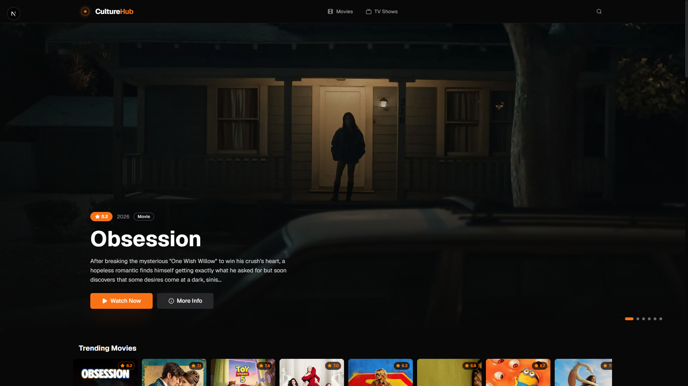
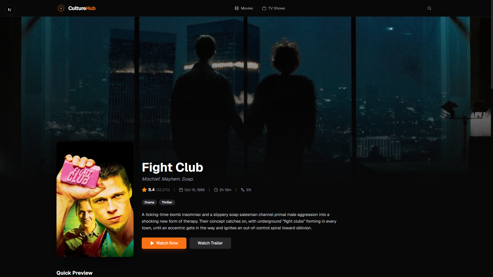
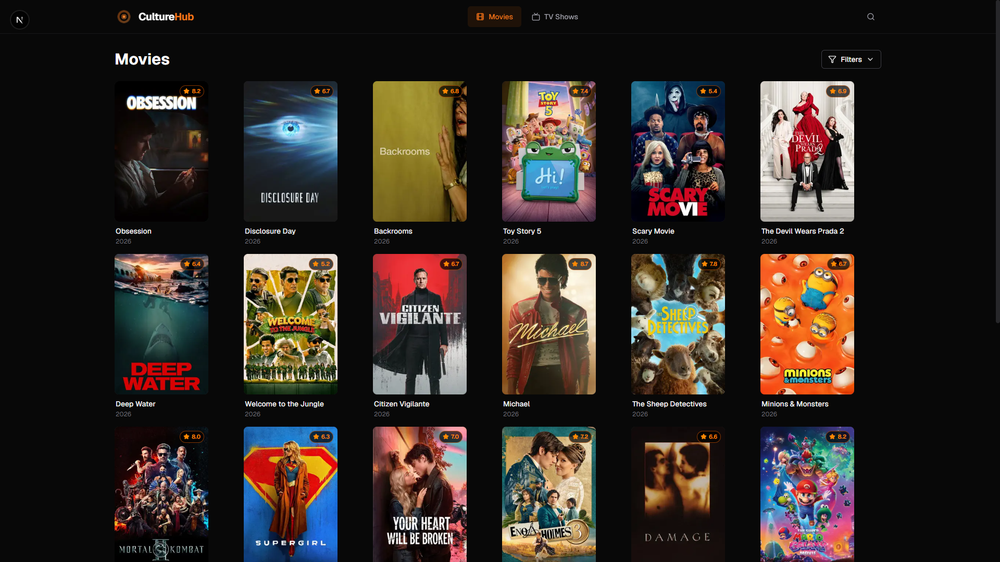
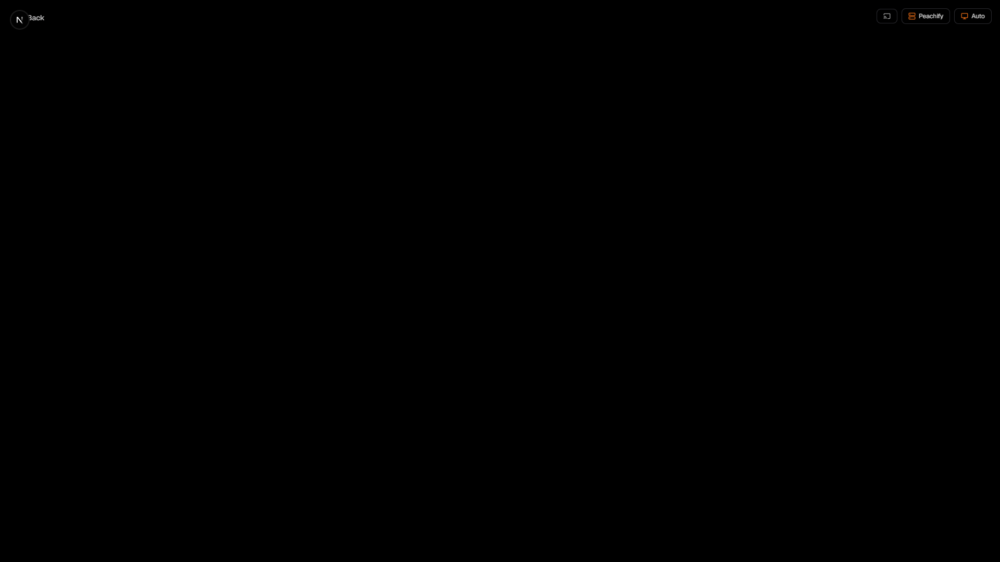

<div align="center">
  
  <h1 align="center">CultureHub</h1>
  <p align="center">
    A modern streaming browser for movies and TV shows, powered by the TMDB API.
    <br />
    Built with Next.js 16, React 19, and Tailwind CSS v4.
  </p>
</div>

---

## Features

- **Browse & Discover** — Trending, popular, top-rated, now-playing, and upcoming movies & TV shows
- **Hindi Content** — Dedicated section for Hindi-language movies and TV shows
- **Powerful Search** — Full-text multi-search across movies, TV shows, and people with pagination
- **Detail Pages** — Rich detail pages with cast, trailers, recommendations, and season/episode breakdowns
- **Multi-Source Video Player** — Switch between 4 streaming sources:
  - [Peachify](https://peachify.top) — Fast & reliable
  - [VidKing](https://www.vidking.net) — Fast player
  - [VidSrc](https://vidsrc.fyi) — Multi-server
  - [VidCore](https://www.vidcore.org) — Premium quality
- **Quality Selector** — Choose quality from 4K to 360p (persisted to localStorage)
- **Chromecast Support** — Cast to your TV via Google Cast SDK
- **Continue Watching** — Progress tracked locally across sessions
- **Dark Theme** — Modern, eye-friendly dark UI with orange accent

---

## Screenshots

<div align="center">
  <table>
    <tr>
      <td align="center"><strong>Homepage</strong></td>
      <td align="center"><strong>Movie Detail</strong></td>
    </tr>
    <tr>
      <td></td>
      <td></td>
    </tr>
    <tr>
      <td align="center"><strong>Browse Movies</strong></td>
      <td align="center"><strong>Watch Page</strong></td>
    </tr>
    <tr>
      <td></td>
      <td></td>
    </tr>
  </table>
</div>

---

## Tech Stack

| Category | Technology |
|----------|-----------|
| **Framework** | [Next.js 16](https://nextjs.org) (App Router) |
| **UI Library** | [React 19](https://react.dev) |
| **Language** | [TypeScript](https://www.typescriptlang.org) |
| **Styling** | [Tailwind CSS v4](https://tailwindcss.com) |
| **Components** | [Radix UI](https://www.radix-ui.com) primitives |
| **Icons** | [Lucide React](https://lucide.dev) |
| **Data Fetching** | [TanStack React Query v5](https://tanstack.com/query) |
| **API** | [TMDB API](https://www.themoviedb.org/documentation/api) |
| **Casting** | [Google Cast SDK](https://developers.google.com/cast) |
| **Linting** | [ESLint](https://eslint.org) |

---

## Getting Started

### Prerequisites

- **Node.js** 18+ (or 20+ for best performance)
- A **TMDB API key** (free) — [get one here](https://www.themoviedb.org/settings/api)

### Setup

1. **Clone the repository**

   ```bash
   git clone <repository-url>
   cd movie-app
   ```

2. **Install dependencies**

   ```bash
   npm install
   ```

3. **Set up environment variables**

   Create a `.env.local` file in the project root:

   ```env
   NEXT_PUBLIC_TMDB_API_KEY=your_tmdb_api_key_here
   ```

4. **Start the development server**

   ```bash
   npm run dev
   ```

5. **Open your browser**

   Navigate to [http://localhost:3000](http://localhost:3000)

### Available Scripts

| Command | Description |
|---------|-------------|
| `npm run dev` | Start development server with Turbopack |
| `npm run build` | Create an optimized production build |
| `npm run start` | Start the production server |
| `npm run lint` | Run ESLint across the project |

---

## Project Structure

```
movie-app/
├── app/                          # Next.js App Router pages
│   ├── layout.tsx                # Root layout (header, footer, providers)
│   ├── page.tsx                  # Homepage (hero + content rows)
│   ├── movie/[id]/page.tsx       # Movie detail page
│   ├── tv/[id]/page.tsx          # TV show detail page
│   ├── watch/
│   │   ├── movie/[id]/page.tsx   # Movie watch/playback page
│   │   └── tv/[id]/[season]/[episode]/page.tsx  # TV watch page
│   ├── movies/page.tsx           # Movie listing/browse
│   ├── tv/page.tsx               # TV listing/browse
│   ├── search/page.tsx           # Search results
│   ├── api/embed/[...path]/route.ts  # Embed proxy (ad-blocking)
│   └── globals.css               # Global styles & theme variables
├── components/                   # Reusable React components
│   ├── VideoPlayer.tsx           # Multi-source iframe video player
│   ├── ServerSelector.tsx        # Streaming source switcher
│   ├── QualitySelector.tsx       # Video quality picker
│   ├── CastButton.tsx            # Chromecast integration
│   ├── HeroBanner.tsx            # Homepage hero carousel
│   ├── ContentRow.tsx            # Horizontal scrollable row
│   ├── MediaCard.tsx             # Media poster card
│   ├── Header.tsx                # Navigation header
│   ├── Footer.tsx                # Site footer
│   ├── SearchCommand.tsx         # Cmd+K search dialog
│   ├── Logo.tsx                  # Animated logo
│   ├── Providers.tsx             # QueryClient provider
│   └── ui/                       # Radix UI primitives
├── hooks/
│   ├── useTMDB.ts                # React Query hooks for TMDB
│   └── useContinueWatching.ts    # localStorage progress tracker
├── lib/
│   ├── tmdb.ts                   # TMDB API fetch functions
│   ├── sources.ts                # Streaming source configuration
│   ├── types.ts                  # TypeScript interfaces
│   └── utils.ts                  # Utility functions
├── public/                       # Static assets
│   ├── culturehub.png            # Site logo
│   ├── favicon.svg               # Favicon
│   ├── placeholder.svg           # Image placeholder
│   └── screenshots/              # App screenshots
├── next.config.ts                # Next.js configuration
├── package.json                  # Dependencies & scripts
├── tsconfig.json                 # TypeScript configuration
├── postcss.config.mjs            # PostCSS configuration
└── eslint.config.mjs             # ESLint configuration
```

---

## Streaming Sources

CultureHub supports multiple streaming backends. You can switch between them while watching:

| Source | Description | Chromecast |
|--------|-------------|------------|
| **Peachify** | Fast & reliable | Built-in player button |
| **VidKing** | Fast player | - |
| **VidSrc** | Multi-server | - |
| **VidCore** | Premium quality | Built-in player button + `chromecast` param |

The active source is persisted to `localStorage` under `culturehub-source`.

---

## Configuration

### Environment Variables

| Variable | Required | Description |
|----------|----------|-------------|
| `NEXT_PUBLIC_TMDB_API_KEY` | Yes | Your TMDB API read-only key (v3 auth) |

### Image Domains

The `next.config.ts` allows remote images from `image.tmdb.org` (TMDB's CDN). No additional configuration needed.

---

## Deployment

### Vercel (Recommended)

1. Push the repository to GitHub
2. Import the project on [Vercel](https://vercel.com/new)
3. Add the environment variable `NEXT_PUBLIC_TMDB_API_KEY`
4. Deploy

### Other Platforms

The app is a standard Next.js application. Build and start:

```bash
npm run build
npm run start
```

---

## License

This project is for educational purposes. All media content is streamed from third-party providers. The owners of this project do not host or distribute any copyrighted content.
